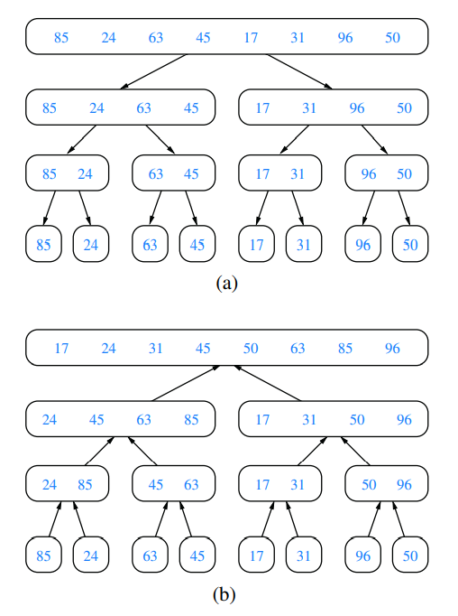
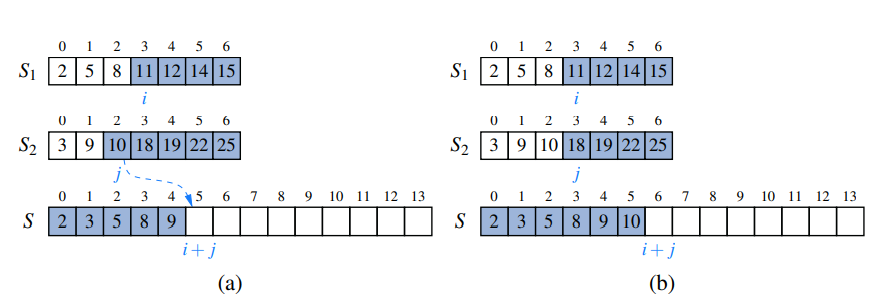
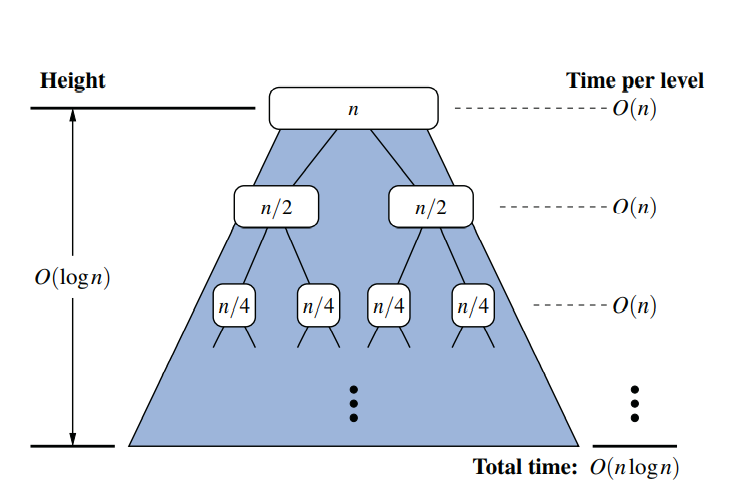

# Divide-and-Conquer approach

The divide-and-conquer pattern consists of the following three
steps:
1. **Divide**: If the input size is smaller than a certain threshold (say, one or two
   elements), solve the problem directly using a straightforward method and
   return the solution so obtained. Otherwise, divide the input data into two or
   more disjoint subsets.
2. **Conquer**: Recursively solve the sub-problems associated with the subsets.
3. **Combine**: Take the solutions to the sub-problems and merge them into a solution to the original problem.

## Divide-and-Conquer for Sorting

To sort a sequence S with n elements using the three divide-and-conquer steps, the merge-sort algorithm proceeds as follows:
1. **Divide**: If S has zero or one element, return S immediately; it is already
   sorted. Otherwise, (S has at least two elements), remove all the elements
   from S and put them into two sequences, S1 and S2, each containing about
   half of the elements of S; that is, S1 contains the first ⌊n/2⌋ elements of S,
   and S2 contains the remaining ⌈n/2⌉ elements.
2. **Conquer**: Recursively sort sequences S1 and S2.
3. **Combine**: Put the elements back into S by merging the sorted sequences S1
   and S2 into a sorted sequence.

# Algorithm visualization by merge-sort tree

Each node of **T** represents a recursive invocation (or call) of the merge-sort algorithm. 
We associate with each node _v_ of **T** the sequence **S** that is processed by the invocation associated with _v_. 
The children of node _v_ are associated with the recursive calls that process the subsequences S1 and
S2 of S. 
The external nodes of **T** are associated with individual elements of **S**,
corresponding to instance of the algorithm that make no recursive calls. 

# Array-Based Implementation of Merge-Sort

During the process,
index i represents the number of elements of S1 that have been copied to S, while
index j represents the number of elements of S2 that have been copied to S. Assuming S1 and S2 both have at least one
uncopied element, we copy the smaller of the two elements being considered. Since i + j objects have been previously copied,
the next element is placed in S[i+ j]. (For example, when i+ j is 0, the next element is copied to S[0]).
If we reach the end of one of the sequences, we must copy the next element from the other.

[Java Implementation](./MergeSort.java)

# The Running Time of Merge-Sort

